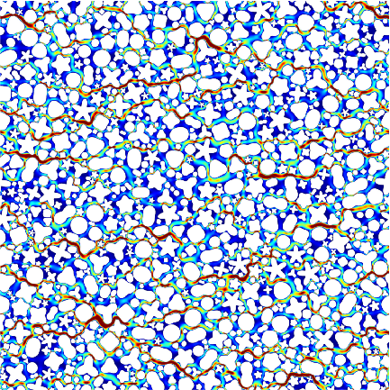

# DPLS-demos

Numerical codes for CPAM paper on doubly-periodic Laplace and Stokes (DPLS)
in 2D. These demonstrate highly-accurate
numerical homogenization of a periodic geometry with one or many random smooth 
inclusions. This is solved for three settings:
potential-drop-driven Laplace Neumann (insulating inclusion) and
Dirichlet (conducting inclusion) BVPs,
and the pressure-drop-driven Stokes Dirichlet (no-slip velocity inclusion) BVP.
There are separate codebases for single-inclusion (dense direct solver) vs multi-inclusion (fast multipole based iterative solver).

Language: MATLAB (without any Toolboxes) / Octave. The multi-inclusion cases need FMM2D (a fortran library with MEX interfaces) to be built.

Authors: Gary Marple and Alex Barnett.  (C) 2017.



### Installation and testing

If you just want the single-inclusion codes, you can stop after the first two lines here. The rest is for the more interesting multi-inclusion case:

```
git clone https://github.com/ahbarnett/DPLS-demos.git
cd DPLS-demos
git submodule init
git submodule update
cd fmm2d
```
Now follow [instructions](https://fmm2d.readthedocs.io/en/latest/install.html) to compile `fmm2d` including its MATLAB/Octave interface. On Linux this means:
```
make matlab
```
Check that `lib-static/libfmm2d.a` and `matlab/fmm2d.mexa64` were built.
Now open MATLAB (at the directory `fmm2d`) and from there do
```
addpath matlab
rfmm2dTest
```
which should pass all tests in about 1 second.
To test DPLS now from MATLAB do
```
cd ../multiinclusion_Laplace
setup
TestScript                        % will show the geometry
LaplaceSolver('Script')
PlotSolution('Script')
```
See the READMEs in the directories below for more details.


### Contents

  * `singleinclusion` - Laplace Neumann and conduction, and Stokes, codes with one inclusion (island) per unit cell, dense linear algebra (by Barnett). Includes codes to generate tables for the periodic square array of discs  
  * `multiinclusion_Laplace` - fast (FMM-based iterative) code for large-scale Laplace demos (by Marple)  
  * `multiinclusion_Stokes` - fast (FMM-based iterative) code for large-scale Stokes demos (by Marple)  
  * `fmm2d` - git submodule of 2D fast multipole method library from the Flatiron Institute  
  * `kdtree` - kd-tree implementation by Andrea Tagliasacchi, needed for geometry handling in multi-inclusion cases (a snapshot of [this](https://github.com/ataiya/kdtree))  

The demos are found in the first three directories; please follow the READMEs found therein.

### References

"A unified integral equation scheme for doubly-periodic Laplace and Stokes boundary value problems in two dimensions,"
Alex H. Barnett, Gary Marple, Shravan Veerapaneni, Lin Zhao.
Comm. Pure Appl. Math., 71(11), 2334–2380 (2018).
[arxiv version](https://arxiv.org/abs/1611.08038)

### Notes

* Some things needing doing are in TODO

* Updated 2024 for git submodules, doc tweaks, for longer-term support.

